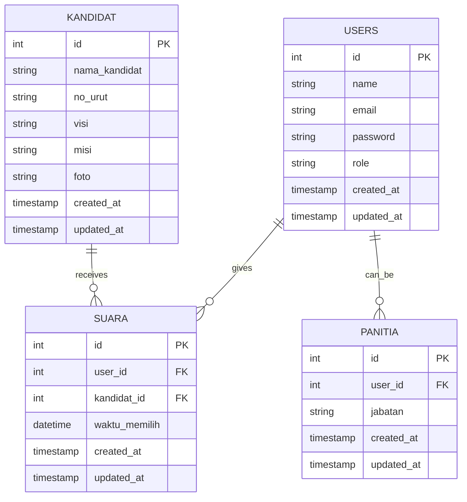
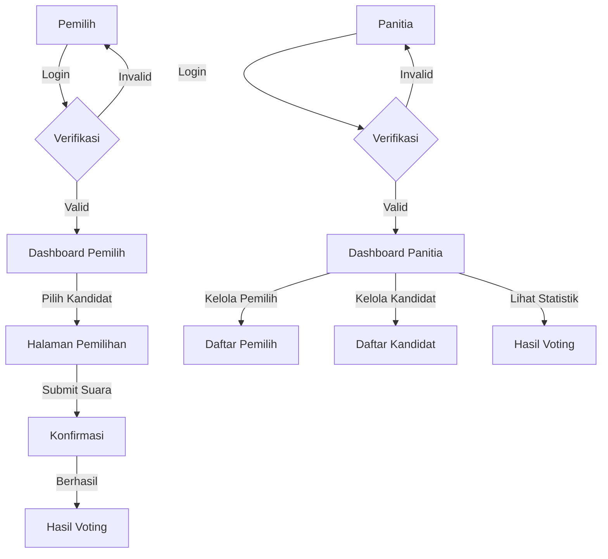

# 🗳️ Aplikasi Voting - Laravel

<div align="center">


</div>

## 📋 Deskripsi
Aplikasi Voting berbasis web yang dikembangkan dengan framework Laravel untuk memfasilitasi proses pemilihan secara elektronik. Aplikasi ini dibuat sebagai bagian dari praktikum mata kuliah Rekayasa Perangkat Lunak di Universitas Amikom Purwokerto.

## ✨ Fitur Utama
- 👥 Manajemen pemilih dan validasi status
- 👑 Manajemen kandidat dengan visi-misi
- 🔐 Sistem autentikasi multi-level (admin, panitia, pemilih)
- 📊 Visualisasi hasil pemilihan
- 🕒 Pencatatan waktu pemilihan
- 📱 Tampilan responsif dengan Bootstrap

## 🖼️ Screenshot


## 🏗️ Struktur Database
Berikut adalah diagram Entity Relationship dari aplikasi:



## 🔄 Alur Aplikasi


## 🚀 Cara Penggunaan

### Prasyarat
- PHP >= 8.0
- Composer
- MySQL
- Node.js & NPM

### Instalasi
1. Clone repositori
   ```bash
   git clone https://github.com/Rimaestro/voting-app.git
   cd voting-app
   ```

2. Instal dependensi
   ```bash
   composer install
   npm install
   ```

3. Salin file .env.example
   ```bash
   cp .env.example .env
   ```

4. Generate application key
   ```bash
   php artisan key:generate
   ```

5. Konfigurasi database di file .env
   ```
   DB_DATABASE=dbvotte_laravel
   DB_USERNAME=root
   DB_PASSWORD=
   ```

6. Jalankan migrasi dan seeder
   ```bash
   php artisan migrate --seed
   ```

7. Kompilasi asset
   ```bash
   npm run dev
   ```

8. Jalankan server
   ```bash
   php artisan serve
   ```

9. Akses aplikasi di browser
   ```
   http://localhost:8000
   ```

## 💻 Teknologi
- **Framework:** Laravel 10
- **Database:** MySQL
- **Frontend:** Bootstrap 5, jQuery, Font Awesome
- **Animasi:** Animate.css

## 👨‍💻 Dikembangkan oleh
Mahasiswa Universitas Amikom Purwokerto untuk memenuhi tugas Praktikum 12 mata kuliah Rekayasa Perangkat Lunak yang dibimbing oleh Irma Darmayanti, M.Kom.

## 📝 Lisensi
Proyek ini dilisensikan di bawah lisensi [MIT](https://opensource.org/licenses/MIT).
